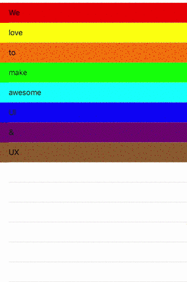

# T-animator


Easily instantiate **T-animator** with your instance of **UITableView**.

And perorm animations on **willDisplay cell: IndxPath**.
Or just use *TAnimatorTableViewController*.

Setup duration, delay and animatoin type you would like to perform.
Small and easy, less than **250** lines of code.

```Swift
open class TAnimatorTableViewController: UITableViewController {
    
    // MARK: - Settings.
    
    /// Set and override default settings.
    public var settings: TAnimatorSettings = TAnimatorSettings(
        type: .bounceIn,
        duration: 0.7,
        delay: 0.3
    )
    
    // MARK: - UITableViewDelegate.
    
    open override func tableView(_ tableView: UITableView, willDisplay cell: UITableViewCell, forRowAt indexPath: IndexPath) {
        
        let animation = TAnimatorFactory.makeAnimation(for: cell, at: indexPath, in: tableView)
        animation(settings)
    }
}
```

Or just create your own ...
```Swift
/// Create a TAnimator or simply create and perform an animation with TAnimatorSettings configuration.
open class TAnimatorFactory {
    
    static public func makeTanimator(using tableView: UITableView) -> TAnimator
    static public func makeAnimation(for cell: UITableViewCell, at indexPath: IndexPath, in tableView: UITableView) -> ((TAnimatorSettings) -> Void) 
}
```

Simple, easy to use.

 

## How to use

```Ruby
pod 'T-animator', :git => 'https://github.com/maturada/T-animator'

import T_animator
```
